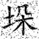
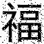
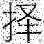
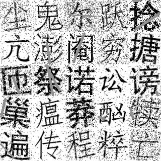

# Hanzi Generator
This tool can generate Hanzi image 
## Install
```shell
# Pillow and opencv are required
python -m pip install Pillow
python -m pip install opencv-python

# Use pip to install HanziG
python -m pip install -U HanziG -i https://test.pypi.org/simple 
```

## Usage
```python3
from PIL import Image
from HanziG import Generator

g = Generator()
for i in range(10):
    img, label = g.gen_sample()
    img = Image.fromarray(img)
    word = label['word']
    img.save(f'{word}.jpg')

g.config(mode='multiple', grid=[5,5])
for i in range(10):
    img, label = g.gen_sample()
    img = Image.fromarray(img)
    img.save(f'{i}.jpg')
    for i in label['words']:
        print(i['word'])
        print(i['location'])
```

## Outputs
### Format
Output is always this format:
```python
image, label
```
For `single` mode, `label` is in this format:
```python
{
    'word': word, # Hanzi
    'index': index # integer
}
```

For `multiple` mode, `label` is in this format:
```python
{
    'words': [word_1, word_2, ..., word_n],
}
```
word_i shall be like this:
```python
{
    'word': word, # Hanzi
    'index': index, # integer
    'size': size, # tuple, for example (64, 64)
    'location': location # tuple, for example (256, 128)
},
```

### Image Example
<h3>single mode result</h3>
<table style="width:70%;text-align:center">
  <tr>
    <th colspan="" width=20% style="text-align:center">寸</th>
    <th style="text-align:center">垛</th>
    <th style="text-align:center">福</th>
    <th style="text-align:center">歌</th>
    <th style="text-align:center">择</th>
  </tr>
  <tr>
    <td></td>
    <td></td>
    <td></td>
    <td></td>
    <td></td>
  </tr>
</table>

<h3>multiple mode result</h3>

